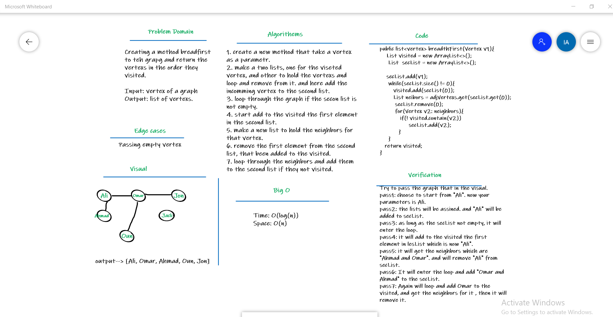
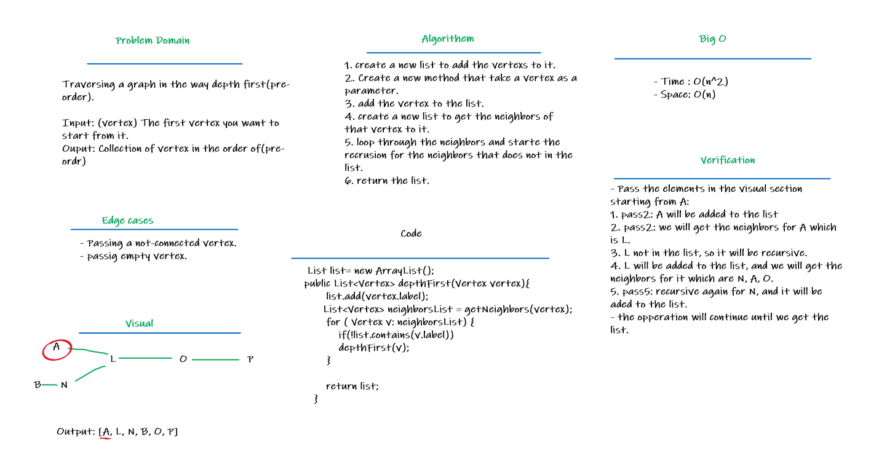

#  Graph Implementation

## Implement a Graph. The graph should be represented as an adjacency list, and should include the following methods:

### add node
Arguments: value
Returns: The added node
Add a node to the graph

### add edge
Arguments: 2 nodes to be connected by the edge, weight (optional)
Returns: nothing

### Adds a new edge between two nodes in the graph
If specified, assign a weight to the edge
Both nodes should already be in the Graph

### get nodes
Arguments: none
Returns all of the nodes in the graph as a collection (set, list, or similar)

### get neighbors
Arguments: node
Returns a collection of edges connected to the given node
Include the weight of the connection in the returned collection

### size
Arguments: none
Returns the total number of nodes in the graph
 
# Approach & Efficiency

    Big O of add Node
        Time: O(1)
        Space: O(n)
    Big O of add Edge
        Time: O(1)
        Space: O(1)
    Big O of get Nodes
        Time: O(1)
        Space: O(1)
    Big O of get neighbors
        Time: O(1)
        Space: O(1)
    Big O of size
        Time: O(1)
        Space: O(1)

## code challenge 36 

## Implement a breadth-first traversal on a graph.

### Write the following method for the Graph class:

breadth first
Arguments: Node
Return: A collection of nodes in the order they were visited.
Display the collection

## code challenge 37

### Write a function called business trip

Arguments: graph, array of city names
Return: cost or null

## code challenge 38

### Write the following method for the Graph class:

depth first
Arguments: Node (Starting point of search)
Return: A collection of nodes in their pre-order depth-first traversal order
Display the collection

