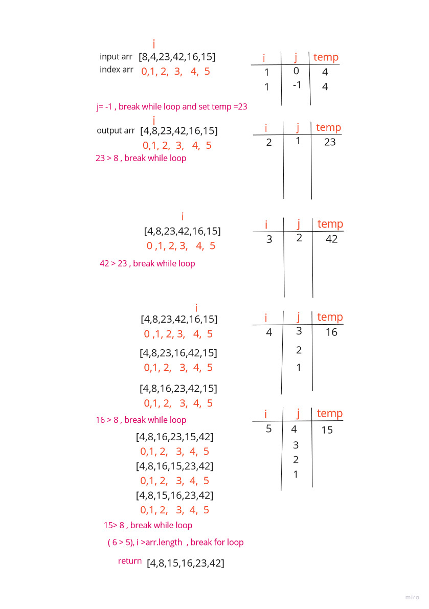

# Insertion Sort 

a  function called insertionSort its take an array and sort it then return  the same array after sorted .

# Pseudocode

 InsertionSort(int[] arr)

    FOR i = 1 to arr.length

      int j <-- i - 1
      int temp <-- arr[i]

      WHILE j >= 0 AND temp < arr[j]
        arr[j + 1] <-- arr[j]
        j <-- j - 1

      arr[j + 1] <-- temp

# Trace
 

Sample Array: [8,4,23,42,16,15]

# Efficency

    Time: O(n^2)
        The basic operation of this algorithm is comparison. This will happen n * (n-1) number of times…concluding the algorithm to be n squared.
    Space: O(1)
        No additional space is being created. This array is being sorted in place…keeping the space at constant O(1).
