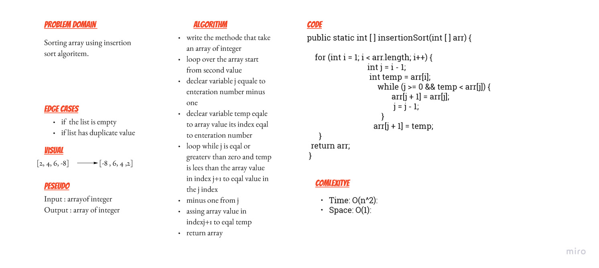
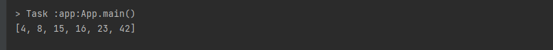

# Insertion Sort 

Write a function called insertionSort its take an array and sort it then retun  the same array after sorted .

## Whiteboard Process

# Solution 
use method as following 

public static void main(String[] args) {
        int[] arr = {8,4,23,42,16,15};
        System.out.println(Arrays.toString(insertionSort(arr)));
}  

output :

